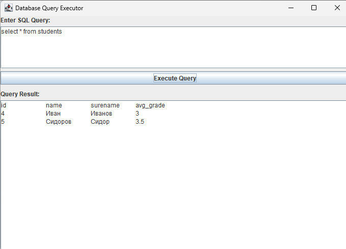

**Цель работы:** Ознакомиться со способами установки соединения с БД при использовании технологии JDBC при разработке клиентских приложений баз данных в системе программирования intellij IDEA.

Для доступа к БД в языке программирования java используется технология JDBC. С ее помощью можно единообразно работать практически с любыми СУБД.

**JDBC (Java Database Connectivity)** представляет собой платформенно независимый промышленный стандарт взаимодействия Java-приложений с различными СУБД.

## Создание соединения java приложения с источником данных(БД)

Первый шаг для подключения БД к java приложению это установка jdbc драйвера для нужной вам СУБД, в нашем случае это PostgreSQL. Чтобы подключить этот драйвер потребуется внесли следующие строчки кода в файл  pom.xml (это файл для подключения библиотек к java). Данный файл будет создам средой разработки после создания проекта, если при создании проекта вы выбрали **build system: Maven.**

```Java
<dependencies>
    <dependency>
        <groupId>org.postgresql</groupId>
        <artifactId>postgresql</artifactId>
        <version>42.2.27</version>
    </dependency>
</dependencies>
```

Чтобы создать соединение с БД нужно указать ссылку на источник данных, имя пользователя и пароль.

Ниже представлен пример кода для подключения к БД:

```Java
import java.sql.Connection;
import java.sql.DriverManager;
import java.sql.SQLException;

public class JDBCConnection {
    private static final String DB_URL = "jdbc:postgresql://localhost:5432/test_db"; 
    private static final String USER = "postgres"; 
    private static final String PASSWORD = "databse_password"; 

    public static void main(String[] args) {
        try (Connection connection = DriverManager.getConnection(DB_URL, USER, PASSWORD)) {
            System.out.println("Connected to database!");
        } catch (SQLException e) {
            e.printStackTrace();
        }
    }
}
```

Подключение к БД выполняется в блоке `try-catch` для обработки исключений, которые могут возникнуть при установлении соединения с БД.

Рассмотрим более подробно:

1. **try** -- выполняет попытку подключения к базе данных с помощью `DriverManager.getConnection()`.

2. Если подключение выполнено успешно\*\*, выполняется `System.out.println("Connected to database!")`.

3. **catch (SQLException e)** -- перехватывает исключение `SQLException`, которое возникает, если: - Сервер базы данных недоступен. - Неверные учётные данные: Ошибка в URL подключения, Password или User (имя пользователя).

4. Выводится сообщение об ошибке с помощью `e.getMessage()` и стека ошибок `e.printStackTrace()`.

**1\. Класс** `DriverManager`

`DriverManager` -- это встроенный в Java класс, который управляет набором драйверов JDBC и отвечает за установление соединений с базой данных.

**Основные методы класса** `DriverManager`**:**

-  `getConnection(String url, String user, String password)`\
   Открывает соединение с базой данных, используя переданный URL, имя пользователя и пароль.

-  `getConnection(String url)`\
   Открывает соединение с базой данных, если авторизация не требуется.

-  `registerDriver(Driver driver)`\
   Регистрирует новый драйвер JDBC (обычно не требуется, так как драйвер загружается автоматически при наличии в `classpath`).

-  `deregisterDriver(Driver driver)`\
   Удаляет зарегистрированный драйвер из `DriverManager`.

Пример использования `DriverManager`:

```Java
Connection connection = DriverManager.getConnection(DB_URL, USER, PASSWORD)
```

Этот вызов заставляет `DriverManager`:

1. Найти подходящий JDBC-драйвер (в нашем случае `org.postgresql.Driver`).

2. Использовать драйвер для установления соединения с базой данных.

3. Вернуть объект `Connection`.

**2\. Класс** `Connection`

`Connection` -- это интерфейс, представляющий соединение с базой данных. Через него выполняются SQL-запросы.

**Основные методы** `Connection`**:**

-  `createStatement()` -- создает объект `Statement` для выполнения SQL-запросов.

-  `prepareStatement(String sql)` -- создает объект `PreparedStatement` для безопасного выполнения SQL-запросов с параметрами.

-  `commit()` -- фиксирует изменения в транзакции.

-  `rollback()` -- откатывает изменения в случае ошибки.

-  `setAutoCommit(boolean autoCommit)` -- включает/отключает автоматическую фиксацию изменений.

-  `close()` -- закрывает соединение с базой данных.

Примеры использования Connection рассмотрим далее при выполнении различных видов запросов к БД.

## Выполнение различных видов запросов к БД

Для начала создадим класс Student, c полями id, name, surename и avgGrade и сущность students в базе данных. Заметим, что имя класса и его полей может не совпадать с названием таблицы и названиями ее атрибутов.

[image:./podklyuchenie-k-istochnikam-danykh-2.png:::0,0,100,100:79::613px:164px]

Ниже представлен код класса Student:

```Java
public class Student {

    private Long id;

    private String name;

    private String surname;

    private Double avgGrade;


    public Student() {

    }

    public Student(String name, String surname, Double avgGrade) {
        this.name = name;
        this.surname = surname;
        this.avgGrade = avgGrade;
    }

    public Long getId() {
        return id;
    }

    public void setId(Long id) {
        this.id = id;
    }

    public String getName() {
        return name;
    }

    public void setName(String name) {
        this.name = name;
    }

    public String getSurname() {
        return surname;
    }

    public void setSurname(String surname) {
        this.surname = surname;
    }

    public Double getAvgGrade() {
        return avgGrade;
    }

    public void setAvgGrade(Double avgGrade) {
        this.avgGrade = avgGrade;
    }

    @Override
    public String toString() {
        return   "\n Student " + id + " = "+ "{" +
                "id=" + id +
                ", name='" + name + '\'' +
                ", surname='" + surname + '\'' +
                ", avgGrade=" + avgGrade +
                '}';
    }
}
```

### Выполнение запросов на обновление данных

Для выполнения запроса на вставку данных создадим класс JDBCUpdate.

```Java
import java.sql.Connection;
import java.sql.DriverManager;
import java.sql.SQLException;
import java.sql.Statement;
import java.util.Scanner;

public class JDBCUpdate {

    static final String DB_URL = "jdbc:postgresql://localhost:5432/test_db";

    static final String USER = "postgres";

    static final String PASSWORD = "databse_password";


    public static void main(String[] args) {

        Connection connection = null;


        try {
            connection = DriverManager.getConnection(DB_URL,USER, PASSWORD);

            Scanner scanner = new Scanner(System.in);
            System.out.println("Enter student name: ");
            String enteredName = scanner.nextLine();

            Statement statement = connection.createStatement();

            String sqlQuery = "UPDATE students SET avg_grade = 3.0 " + "WHERE name = '" + enteredName + "'";

            //sql injection: UPDATE students SET avg_grade = 3.0 WHERE name = 'name' OR '1'='1'

            statement.executeUpdate(sqlQuery);

            statement.close();
        }
        catch (SQLException e){
            e.printStackTrace();
        }
        finally {
            try {
                connection.close();
            } catch (SQLException e) {
                e.printStackTrace();
            }
        }
    }
}
```

В данном коде мы выполним запрос на обновление `avg_grade` по имени студента. Но данный метод выполнения запрос является не безопаcным, так как пользователь может ввести в поле `enteredName` не свое имя, а фрагмент запроса, который может внести не желаемые изменения в БД, такие запросы называются **SQL инъекциями.**

Например, если в enteredName ввести:

```Java
'Иван' OR '1'='1'
```

В таком случае у всех студентов в БД, атрибут avg_grade примет значение 3.0

Чтобы избежать подобного рода ситуаций, в java был добавлен класс `PreparedStatement` .

Рассмотрим как бы выглядел запрос на обновление данных с использование PreparedStatement. Для этого создадим класс **JDBCUpdate_v2**:

```JavaScript
import java.sql.*;
import java.util.Scanner;

public class JDBCUpdate_v2 {

    static final String DB_URL = "jdbc:postgresql://localhost:5432/test_db";

    static final String USER = "postgres";

    static final String PASSWORD = "databse_password";


    public static void main(String[] args) {

        Connection connection = null;


        try {
            connection = DriverManager.getConnection(DB_URL,USER, PASSWORD);

            Scanner scanner = new Scanner(System.in);
            System.out.println("Enter student name: ");
            String enteredName = scanner.nextLine();

            PreparedStatement statement = connection.prepareStatement("UPDATE students SET avg_grade = 3.5 WHERE name = ?");
            statement.setString(1, enteredName);
            statement.executeUpdate();
            connection.close();
        }
        catch (SQLException e){
            e.printStackTrace();
        }
        finally {
            try {
                connection.close();
            } catch (SQLException e) {
                e.printStackTrace();
            }
        }
    }
}
```

#### `PreparedStatement` в Java

`PreparedStatement` -- это интерфейс в Java, который используется для выполнения SQL-запросов, которые могут содержать параметры. Это расширение интерфейса `Statement`, предназначенное для повышения производительности и безопасности при работе с базой данных.

#### Преимущества использования `PreparedStatement`:

1. **Защита от SQL-инъекций:** одним из основных преимуществ `PreparedStatement` является защита от SQL-инъекций. Когда вы используете `Statement`, данные напрямую включаются в SQL-запрос в виде строк, что может быть уязвимо для атак, если не экранировать вводимые пользователем данные. В отличие от этого, `PreparedStatement` использует параметры для подстановки значений в запрос, автоматически экранируя данные, что предотвращает SQL-инъекции.

2. **Повторное использование запросов:** `PreparedStatement` позволяет использовать один и тот же SQL-запрос несколько раз с разными параметрами, что повышает производительность. SQL-запрос компилируется только один раз, а затем может быть выполнен с разными параметрами.

3. **Повышение производительности:** когда запросы выполняются несколько раз, база данных может кэшировать план выполнения запроса, что ускоряет выполнение запросов с одинаковой структурой.

4. **Удобство использования параметров:** параметры в `PreparedStatement` можно задавать с помощью методов, таких как `setString()`, `setInt()`, `setDouble()`, которые автоматически обрабатывают типы данных, избавляя от необходимости вручную форматировать строки SQL-запроса.

#### Как работает `PreparedStatement`:

-  **Подготовка запроса:** вы создаете строку SQL-запроса с местами для параметров, которые обозначаются знаком вопроса (`?`).

-  **Установка значений параметров:** Затем вы устанавливаете значения для этих параметров с помощью методов типа `setX()` (например, `setString()`, `setInt()`, `setDouble()`).

-  **Выполнение запроса:** После этого вы выполняете запрос с помощью метода `executeUpdate()`, если запрос изменяет данные (например, `INSERT`, `UPDATE`, `DELETE`), или `executeQuery()`, если нужно получить данные.

#### Пример использования `PreparedStatement` в коде:

```Java
// SQL-запрос с параметром
PreparedStatement statement = connection.prepareStatement(
    "UPDATE students SET avg_grade = 3.5 WHERE name = ?");

// Устанавливаем значение параметра (имя студента)
statement.setString(1, enteredName);

// Выполняем запрос
statement.executeUpdate();
```

В этом примере:

1. **SQL-запрос**: `"UPDATE students SET avg_grade = 7.5 WHERE name = ?"` -- это запрос, который обновляет среднюю оценку для студента с указанным именем. Вместо того чтобы вставлять имя студента напрямую в запрос, используется параметр `?`.

2. **Установка параметра**: `statement.setString(1, enteredName)` -- метод `setString()` используется для подстановки значения переменной `enteredName` в первый параметр запроса (первый `?`). Индекс параметра начинается с 1 (а не с 0, как в массиве).

3. **Выполнение запроса**: `statement.executeUpdate()` -- выполняет обновление в базе данных. Этот метод применяется для SQL-запросов, которые изменяют данные (например, `INSERT`, `UPDATE`, `DELETE`).

#### Зачем нужен `PreparedStatement` в этом коде?

В вашем примере код выполняет **обновление** записи в базе данных:

```Java
PreparedStatement statement = connection.prepareStatement(
    "UPDATE students SET avg_grade = 3.5 WHERE name = ?");
```

Здесь используется `PreparedStatement` для безопасного обновления средней оценки студента с определенным именем, которое вводит пользователь. Запрос `"UPDATE students SET avg_grade = 7.5 WHERE name = ?"` имеет параметр `?`, который будет заменен на имя студента, введенное пользователем через `Scanner`.

#### Преимущества использования `PreparedStatement` в этом контексте:

1. **Защита от SQL-инъекций**: если бы имя студента вставлялось напрямую в запрос (например, с помощью конкатенации строк), это могло бы привести к SQL-инъекции, если пользователь введёт вредоносные данные (например, `John'; DROP TABLE students; --`). При использовании `PreparedStatement` данные автоматически экранируются, и такого рода атака становится невозможной.

2. **Удобство работы с параметрами**: вместо того, чтобы вручную формировать строку запроса и опасаться ошибок в форматировании, `PreparedStatement` позволяет удобно подставлять параметры с помощью методов `setString()`, `setInt()`, и т. д.

3. **Повторное использование запроса**: если нужно выполнить один и тот же запрос несколько раз с разными именами студентов, `PreparedStatement` позволит повторно использовать один и тот же запрос, подставляя различные значения.

Таким образом, использование `PreparedStatement` не только делает код безопасным, но и упрощает работу с SQL-запросами и повышает производительность приложения.

### Выполнение запросов на вставку данных

Для выполнения запроса на вставку данных создадим класс JDBCInsert.

```Java
import org.example.entity.Student;

import java.sql.*;

public class JDBCInsert_v2 {

    static final String DB_URL = "jdbc:postgresql://localhost:5432/test_db";

    static final String USER = "postgres";

    static final String PASSWORD = "databse_password";


    public static void main(String[] args) {

        Connection connection = null;

        Student student = new Student("Иванов","Иван",3.0);

        try {
            connection = DriverManager.getConnection(DB_URL,USER, PASSWORD);

            Statement statement = connection.createStatement();

            String sqlQuery = "INSERT INTO students(name, surename,avg_grade) VALUES" + "('"
                    + student.getName() + "','"
                    + student.getSurname() + "','"
                    + student.getAvgGrade() + "')";

            //insert into students(name, surename, avg_grade) values("Иванов","Иван",3.0)

            statement.executeUpdate(sqlQuery);

            statement.close();
        }
        catch (SQLException e){
            e.printStackTrace();
        }
        finally {
            try {
                connection.close();
            } catch (SQLException e) {
                e.printStackTrace();
            }
        }
    }
}
```

В этом классе так же укажем данные для подключения к БД и выполним соединения.

Чтобы занести студента в БД нужно создать  экземпляр класса Student:

```Java
Student student = new Student("Иван","Иванов",3.0);
```

Далее в блоке try устанавливаем соединение. Далее разберемся что такое Statement.

`Statement` -- это интерфейс в Java, который используется для выполнения SQL-запросов, обновлений или других операций с базой данных. Вы можете использовать объект типа `Statement` для:

-  Выполнения SQL-запросов (например, `SELECT`).

-  Выполнения обновлений данных (например, `INSERT`, `UPDATE`, `DELETE`).

-  Получения результатов выполнения запросов.

Далее создаем объект sqlQuery типа String, который и будет являться запросом к БД:

```Java
 String sqlQuery = "INSERT INTO students(name, surename,avg_grade) VALUES" + "('"
                    + student.getName() + "','"
                    + student.getSurname() + "','"
                    + student.getAvgGrade() + "')";
```

Чтобы выполнить запрос на вставку в БД, нужно использовать метод `executeUpdate` интерфейса `Statement`, и как параметр метода передать `sqlQuery`:

```Java
 statement.executeUpdate(sqlQuery);
```

После чего нужно закрыть statement:

```Java
statement.close();
```

А так же закрыть соединение, что мы выполнили в блоке finaly:

```Java
finally {
            try {
                connection.close();
            } catch (SQLException e) {
                e.printStackTrace();
            }
        }
```

Если подключение не было закрыто, то с помощью метода `stackTrace()` получим сообщение об ошибке.

### Выполнение запросов на удаление данных

Для выполнения запроса на вставку данных создадим класс JDBCDelete.

```Java
import java.sql.*;

public class JDBCDelete {

    static final String DB_URL = "jdbc:postgresql://localhost:5432/test_db";

    static final String USER = "postgres";

    static final String PASSWORD = "databse_password";


    public static void main(String[] args) {

        Connection connection = null;


        try {
            connection = DriverManager.getConnection(DB_URL,USER, PASSWORD);

            PreparedStatement statement = connection.prepareStatement(
                    "delete from students Where name=?"
            );
            statement.setString(1, "Иван");

            int deletedRows = statement.executeUpdate();

            System.out.println("Deleted " + deletedRows + " rows");

            statement.close();

            connection.close();

        }
        catch (SQLException e){
            e.printStackTrace();
        }
        finally {
            try {
                connection.close();
            } catch (SQLException e) {
                e.printStackTrace();
            }
        }
    }
}
```

Запросы на удаление данных выполняются аналогично другим запросам, отличие только в значение переданном в объект PreparedStatement:

```Java
PreparedStatement statement = connection.prepareStatement(
                    "delete from students Where name=?");
statement.setString(1, "Иван");
```

### Выполнение запросов на выборку данных

Для выполнения запроса на вставку данных создадим класс JDBCInsert.

```Java
import org.example.entity.Student;
import java.sql.Connection;
import java.sql.DriverManager;
import java.sql.PreparedStatement;
import java.sql.SQLException;

public class JDBCInsert {

    static final String DB_URL = "jdbc:postgresql://localhost:5432/test_db";

    static final String USER = "postgres";

    static final String PASSWORD = "databse_password";


    public static void main(String[] args) {

        Connection connection = null;

        Student student = new Student("Сидоров","Сидор",3.5);

        try {
            connection = DriverManager.getConnection(DB_URL,USER, PASSWORD);

            PreparedStatement statement = connection.prepareStatement("insert into students(name, surename, avg_grade) values(?,?,?)");

            statement.setString(1, student.getName());
            statement.setString(2, student.getSurname());
            statement.setDouble(3,student.getAvgGrade());

            statement.executeUpdate();

            statement.close();
        }
        catch (SQLException e){
            e.printStackTrace();
        }
        finally {
            try {
                connection.close();
            } catch (SQLException e) {
                e.printStackTrace();
            }
        }
    }
}
```

Запросы на выборку данных выполняются аналогично другим запросам, отличие только в значение переданном в объект PreparedStatement:

```Java
PreparedStatement statement = connection.prepareStatement("insert into students(name, surename, avg_grade) values(?,?,?)");

            statement.setString(1, student.getName());
            statement.setString(2, student.getSurname());
            statement.setDouble(3,student.getAvgGrade());
```

## Создание клиентской формы для выполнения запросов

Создадим класс DatabaseUI:

```Java
import javax.swing.*;
import java.awt.*;
import java.awt.event.ActionEvent;
import java.awt.event.ActionListener;
import java.sql.*;

public class DatabaseUI {
    private static final String DB_URL = "jdbc:postgresql://localhost:5432/test_db";
    private static final String USER = "postgres";
    private static final String PASSWORD = "databse_password";

    public static void main(String[] args) {
        JFrame frame = new JFrame("Database Query Executor");
        frame.setDefaultCloseOperation(JFrame.EXIT_ON_CLOSE);
        frame.setSize(700, 500);

        JPanel panel = new JPanel();
        panel.setLayout(new BorderLayout(10, 10));

        JLabel queryLabel = new JLabel("Enter SQL Query:");
        JTextArea queryField = new JTextArea(5, 50);
        queryField.setLineWrap(true);
        queryField.setWrapStyleWord(true);
        JScrollPane queryScrollPane = new JScrollPane(queryField);

        JButton executeButton = new JButton("Execute Query");
        JLabel resultLabel = new JLabel("Query Result:");
        JTextArea resultArea = new JTextArea(15, 50);
        resultArea.setEditable(false);
        JScrollPane resultScrollPane = new JScrollPane(resultArea);

        executeButton.addActionListener(new ActionListener() {
            @Override
            public void actionPerformed(ActionEvent e) {
                String query = queryField.getText();
                executeQuery(query, resultArea);
            }
        });

        JPanel inputPanel = new JPanel();
        inputPanel.setLayout(new BorderLayout(5, 5));
        inputPanel.add(queryLabel, BorderLayout.NORTH);
        inputPanel.add(queryScrollPane, BorderLayout.CENTER);
        inputPanel.add(executeButton, BorderLayout.SOUTH);

        JPanel resultPanel = new JPanel();
        resultPanel.setLayout(new BorderLayout(5, 5));
        resultPanel.add(resultLabel, BorderLayout.NORTH);
        resultPanel.add(resultScrollPane, BorderLayout.CENTER);

        panel.add(inputPanel, BorderLayout.NORTH);
        panel.add(resultPanel, BorderLayout.CENTER);

        frame.add(panel);
        frame.setVisible(true);
    }

    private static void executeQuery(String query, JTextArea resultArea) {
        try (Connection connection = DriverManager.getConnection(DB_URL, USER, PASSWORD);
             Statement statement = connection.createStatement()) {

            if (query.trim().toUpperCase().startsWith("SELECT")) {
                ResultSet resultSet = statement.executeQuery(query);
                ResultSetMetaData metaData = resultSet.getMetaData();
                int columnCount = metaData.getColumnCount();

                StringBuilder resultText = new StringBuilder();
                for (int i = 1; i <= columnCount; i++) {
                    resultText.append(metaData.getColumnName(i)).append("\t");
                }
                resultText.append("\n");

                while (resultSet.next()) {
                    for (int i = 1; i <= columnCount; i++) {
                        resultText.append(resultSet.getString(i)).append("\t");
                    }
                    resultText.append("\n");
                }

                resultArea.setText(resultText.toString());
            } else {
                int affectedRows = statement.executeUpdate(query);
                resultArea.setText("Query executed successfully. Affected rows: " + affectedRows);
            }
        } catch (SQLException ex) {
            resultArea.setText("Error: " + ex.getMessage());
        }
    }
}
```

### Импортируемые пакеты:

1. `import javax.swing.*;` -- импортирует все компоненты Swing, такие как окна (`JFrame`), панели (`JPanel`), кнопки (`JButton`), текстовые поля (`JTextArea`), метки (`JLabel`), и другие элементы интерфейса.

2. `import java.awt.*;` -- импортирует компоненты из пакета AWT, такие как `BorderLayout`, которые используются для управления компоновкой элементов.

3. `import java.awt.event.ActionEvent;` **и** `import java.awt.event.ActionListener;` -- импортируют классы.

4. `import java.sql.*;`, `Connection` -- импортирует классы JDBC, используемые для взаимодействия`Statement`, `ResultSet`).

### Структура класса `DatabaseUI`:

1. Константы для подключения к базе данных:

   ```Java
   private static final String DB_URL = "jdbc:postgresql://localhost:5432/test_db";
   private static final String USER = "postgres";
   private static final String PASSWORD = "databse_password";
   ```

2. **Метод** `main`**:** 

   -  **Создание окна** `JFrame`**:**

      ```Java
      JFrame frame = new JFrame("Database Query Executor");
      frame.setDefaultCloseOperation(JFrame.EXIT_ON_CLOSE);
      frame.setSize(700, 500); 
      //Здесь создается главное окно с заголовком
      ```

      Здесь создается главное окно с заголовком «Исполнитель запросов к базе данных», устанавливается операция закрытия (закрытие окна завершает работу приложения) и задается размер окна (700x500 пикселей).

   -  **Создание панели для содержимого** `JPanel`**:**

      ```Java
      JPanel panel = new JPanel();
      panel.setLayout(new BorderLayout(10, 10));
      ```

      Создаётся панель, которая будет содержать все элементы интерфейса. Она использует компоновку `BorderLayout` с отступами в 10 пикселей.

3. **Компоненты ввода SQL-запроса:**

   -  `JLabel queryLabel` -- метка, информирующая пользователя о необходимости ввести SQL-запрос.

   -  `JTextArea queryField` -- текстовая область, в которой пользователь может ввести свой SQL-запрос. Она имеет несколько строк (5) и ширину 50 символов.

   -  `JScrollPane queryScrollPane` -- добавляется прокрутка, если текст в поле запроса превышает видимую область.

   -  `JButton executeButton` -- кнопка, которая выполняет SQL-запрос, когда пользователь нажимает на нее.

4. **Компоненты для отображения результата запроса:**

   -  `JLabel resultLabel` -- метка, которая информирует пользователя о том, что ниже будет показан результат выполнения SQL-запроса.

   -  `JTextArea resultArea` -- текстовая область для отображения результата SQL-запроса. Она доступна только для чтения (не редактируется).

   -  `JScrollPane resultScrollPane` -- добавляется прокрутка, если результат превышает видимую область.

5. **Обработчик события кнопки** `executeButton`**:** При нажатии на кнопку «Выполнить запрос» вызывается метод `actionPerformed`, который:

   -  Извлекает текст из текстовой области `queryField`.

   -  Вызывает метод `executeQuery(query, resultArea)`, который будет выполнять SQL-запрос и отображать результат в `resultArea`.

   Пример обработчика:

   ```Java
   executeButton.addActionListener(new ActionListener() {
       @Override
       public void actionPerformed(ActionEvent e) {
           String query = queryField.getText();
           executeQuery(query, resultArea);
       }
   });
   ```

6. **Панели для ввода и отображения результата:**

   -  `inputPanel` -- панель, которая содержит метку для ввода SQL-запроса, текстовое поле для ввода и кнопку для выполнения запроса.

   -  `resultPanel` -- панель, которая содержит метку для отображения результата запроса и текстовую область для вывода результатов.

   Эти панели добавляются в основную панель с использованием компоновки `BorderLayout`.

7. **Настройка окна:** В конце метода `main` добавляется главная панель `panel` в окно `frame`, и окно становится видимым:

   ```Java
   frame.add(panel);
   frame.setVisible(true);
   ```

### Метод `executeQuery`:

Метод `executeQuery` (которого не хватает в коде, но он должен быть добавлен) выполняет SQL-запрос и выводит результаты в `resultArea`.

Пример реализации метода `executeQuery`:

```Java
private static void executeQuery(String query, JTextArea resultArea) {
    try (Connection connection = DriverManager.getConnection(DB_URL, USER, PASSWORD);
         Statement statement = connection.createStatement()) {

        ResultSet resultSet = statement.executeQuery(query);
        StringBuilder result = new StringBuilder();
        
        // Обработка результатов
        while (resultSet.next()) {
            result.append("Row: ");
            result.append(resultSet.getString(1));  // Или другой код для получения данных
            result.append("\n");
        }

        resultArea.setText(result.toString());
    } catch (SQLException e) {
        resultArea.setText("Error: " + e.getMessage());
    }
}
```

В итоге получим пользовательскую форму для выполнения запросов к БД, которая представлена на рисунке ниже.

{width=679px height=489px}